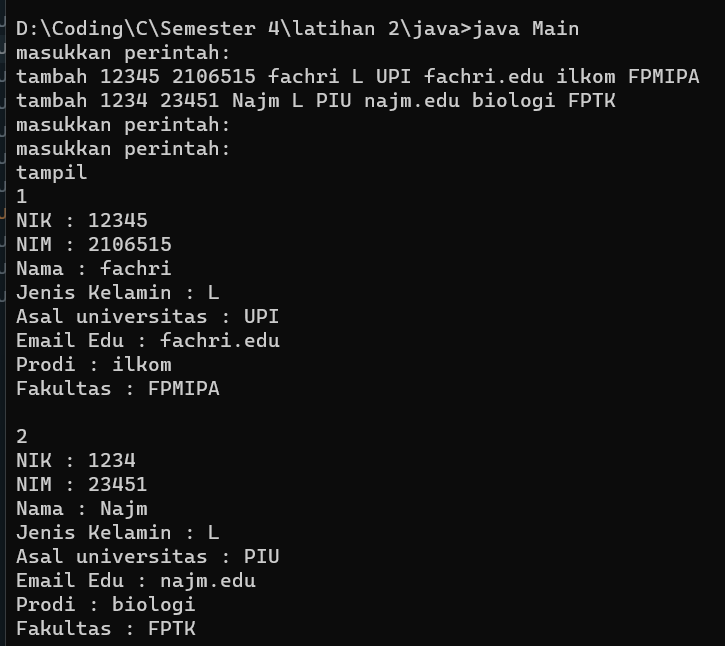

## Janji
Saya Fachri Najm Noer Kartiman NIM 2106515 mengerjakan soal Latihan 2
dalam mata kuliah Desain Pemrograman Berorientasi Objek untuk keberkahanNya
maka saya tidak melakukan kecurangan seperti yang telah dispesifikasikan.
Aamiin.

# Tugas LATIHAN1DPBO2023
Buatlah program berbasis OOP menggunakan bahasa pemrograman C++, Java, Python, dan PHP yang mengimplementasikan konsep Multi-level Inheritance  pada kelas - kelas tersebut:
Mahasiswa: NIM, nama, jenis_kelamin, fakultas, prodi
Human: NIK, nama, jenis_kelamin
SivitasAkademik: asal_universitas, email_edu

File README berisi desain program, penjelasan alur, dan dokumentasi saat program dijalankan (screenshot/screen record, pilih salah satu bahasa sebagai contoh)

Submit link repository pada form berikut: [Form Pengumpulan](https://forms.gle/rvb1hKxbQVuYNbhKA) 

## Desain Program
Desain yang saya buat menggunakan 4 Class:
* Human
* Sivitas Akademik
* Mahasiswa
* Crud

`Class Human` memiliki total tiga atribut:
* **NIK** -> NIK manusia, `string`
* **Nama** -> nama manusia, `string`
* **Nama** -> jenis kelamin manusia, `string`

`Class SivitasAkademik` memiliki total dua atribut dan atribut dari parentnya `Class Human`:
* **asalUniv** -> asal Universitas sivitas akademik, `string`
* **emailEdu** -> email Edu sivitas akademik, `string`

`Class Mahasiswa` memiliki total tiga atribut dan atribut dari parentnya `Class SivitasAkademik`:
* **NIM** -> NIM mahasiswa, `string`
* **Prodi** -> program studi mahasiswa, `string`
* **Fakultas** -> Fakultas mahasiswa, `string`

_Semua Class diatas dilengkapi dengan setter dan getternya_

Pada Class class diats dilakukan multi-level inheritance dari 

`Class Human` -> `Class SivitasAkademik` -> `Class Mahasiswa`

`Kenapa?` karena `Mahasiswa` adalah `SivitasAkademik` dan `SivitasAkademik` adalah `Human`

maka pewarisan dilakukan dari `Class Human` ke `Class SivitasAkademik` ke `Class Mahasiswa`

`Class Crud` memiliki total dua atribut:
* **list** -> array untuk menyimpan class Mahasiswa, `array of Mahasiswa`
* **listNim** -> array untuk menyimpan NIM, `array of integer`

dan `Class Crud` memiliki total empat method:
* **tambah** -> menambah data Mahasiswa ke `list` dan NIM nya ke `listNim`
* **tampil** -> menampilkan data Mahasiswa dari `list`
<!-- * **hapus** -> menghapus data Mahasiswa ke `list` dan NIM nya ke `listNim`
* **ganti** -> mengganti data Mahasiswa ke `list` dan NIM nya ke `listNim` -->

Pada `Class Crud` terdapat dua list yaitu `list` dan `listNim`

`Kenapa?` itu dibuat agar library yang ada digunakan dengan semestinya seperti library find pada bahasa c++ dipakai untuk mengecek apakah disuatu data terdapat data NIM yang redundant atau tidak jadi bisa dicek di `listNIM`

## Alur Program
**semua program mempunyai alur yang sama, kecuali PHP karena inputan secara hardcore dari codenya**

Pengguna akan diminta untuk mengetikkan perintah pada command prompt

Pengguna dapat memilih untuk mengetikkan serangkaian perintah berikut pada command prompt

- ketik `tambah [NIK] [NIM] [Nama] [Jenis Kelamin] [Asal Universitas] [Email Edu] [Prodi] [Fakultas]` untuk menambah data pada list

<!-- - ketik `ganti [NIM] [Nama] [Prodi] [Fakultas]` untuk mengganti data pada list -->

<!-- - ketik `hapus [NIM]` untuk menghapus data pada list -->

- ketik `tampil` untuk menampilkan data pada list

- ketik `exit` untuk keluar dari looping

Seteleh memilih maka akan dimintai mengetikkan perintah berikutnya sampai mengetik perintah `exit`

## Dokumentasi
**Program Java**

### Test Case
tambah 12345 2106515 fachri L UPI fachri.edu ilkom FPMIPA

tambah 1234 23451 Najm L PIU najm.edu biologi FPTK

tampil